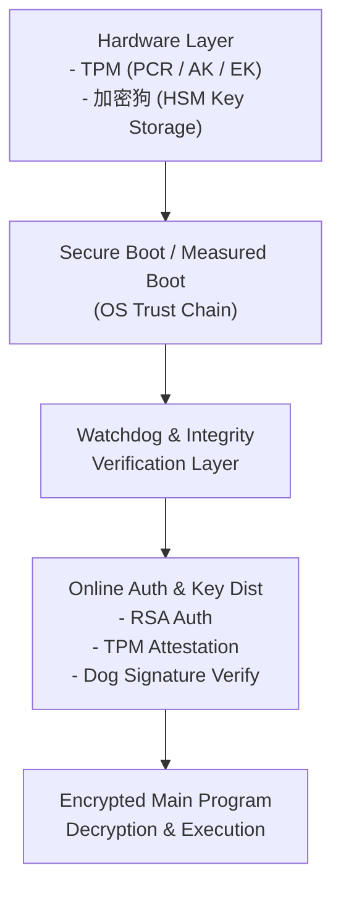

# MTC: MTC's Trusted Computing
# 基于融合 TPM、加密狗与 RSA 的多重信任链高安全在线程序分发与执行系统

本项目旨在构建一个适用于高敏感、高风险环境的软件分发与执行体系。  
系统融合 **TPM（可信平台模块）**、**硬件加密狗**、**RSA 非对称认证体系** 与 **完整性验证机制**，实现真正意义上的 **多重信任链**（Multi-Trust-Chain）安全架构。

该系统模拟工业控制、街机平台、封闭式设备等高度受控环境下的程序发布、更新与授权执行流程。

---

## ✨ 项目特性（Features）

- **TPM可信启动链（Measured Boot）**
  - 验证系统、驱动、主程序在启动过程中的完整性
  - PCR 值用于远程证明（Remote Attestation）

- **硬件加密狗鉴权（HSM-like）**
  - 私钥存储不可导出
  - 对系统信息、硬件指纹、主程序摘要进行签名认证

- **RSA + AES 混合加密的启动密钥机制**
  - 启动密钥仅在服务器授权后下发
  - 会话密钥采用 AES-256，由 RSA 公钥保护

- **加密狗 × TPM 双因子硬件信任链**
  - 同时要求 TPM 状态正常 + 加密狗有效存在
  - 防止硬盘克隆、程序拷贝、虚拟机伪造执行环境

- **安全分发服务器（DIST-SRV）**
  - 基于无公网 DNS 指向的内部访问域名
  - 检查硬件/系统/加密狗签名一致性
  - 下发启动密钥或更新指令

- **Watchdog 反调试与行为检测**
  - Watchdog 守护主程序
  - 若被终止 → 触发强制系统冻结（BSOD/Panic）

- **远程自动更新（DIST-UPDATE）**
  - 支持后台拉取最新构建
  - 按需热更新或强制更新主程序

---

## 🧩 技术架构

---

## 🔐 系统流程概述

1. **设备启动 → TPM 建立可信链**
2. **Watchdog 启动，验证加密狗存在性**
3. **生成系统信息 + 硬件指纹 + 主程序摘要（MD5/SHA256）**
4. **加密狗使用私钥对信息签名**
5. **向 am-dist.akiacg.com（无公网 DNS）发起认证请求**
6. **服务器验证：**
   - TPM PCR 状态  
   - 加密狗签名  
   - 硬件/系统一致性  
7. **服务器响应：**
   - 200 → 下发启动密钥  
   - 255 → 下发主程序更新链接  
   - error → 阻止启动  
8. **使用启动密钥解密主程序（AES）并执行**
9. **Watchdog 持续检测运行状态与篡改行为**

---

## 📚 使用到的技术

- **TPM 2.0**
  - PCR Measurement  
  - Attestation Key (AK)
  - Unseal 功能绑定执行环境

- **加密狗 / USB HSM**
  - 不可导出的 RSA 私钥
  - 本地签名与身份确认

- **RSA 2048/4096**
  - 认证请求签名验证
  - 启动密钥加密

- **AES-256-GCM**
  - 主程序解密与完整性验证

- **Watchdog + 驱动层调起系统强行终止**
  - 主程序防调试  
  - 行为异常触发直接销毁数据  

---

## 📄 License

暂时使用 MIT

---

# TODO List

## 🔧 Client 侧开发
- [ ] 构建精简系统（WinPE/Custom Windows）
- [ ] 集成 TPM 启动链验证（PCR Measurement）
- [ ] 开发 Watchdog 守护程序
- [ ] 加密狗通信模块（API 封装）
- [ ] RSA 签名请求生成模块
- [ ] TPM Attestation（AK 证明）
- [ ] 客户端加密主程序加载器
- [ ] AES 启动密钥解密器
- [ ] 篡改检测与反调试机制
- [ ] Watchdog 触发蓝屏/强制停止机制
- [ ] 自动更新下载器（DIST-UPDATE）
- [ ] 错误处理与 UI 提示模块

## 🖥️ Server 侧开发
- [ ] API Server 框架搭建
- [ ] 硬件指纹与系统指纹比对模块
- [ ] TPM PCR 验证逻辑
- [ ] 加密狗签名验证模块
- [ ] 启动密钥生成与下发模块
- [ ] 程序版本检查与更新条目下发（255流程）
- [ ] 安全日志与审计系统
- [ ] 内部专用域名配置
- [ ] 区域/访问控制（无公网 DNS）
- [ ] 可视化后台管理界面（可选）

## 📘 Documentation
- [ ] 设计文档（Architecture）
- [ ] 通信协议定义（Protocol）
- [ ] 系统信任链图（Trust Chain Diagram）
- [ ] 启动流程序列图（Sequence Diagram）
- [ ] 安全性分析报告（Attack Surface & Defense）

---

### **灵感来源：Siemens Simatic, FlexNet Licensing, SEGA Amusement Linkage Live System & ALL-NET.**
